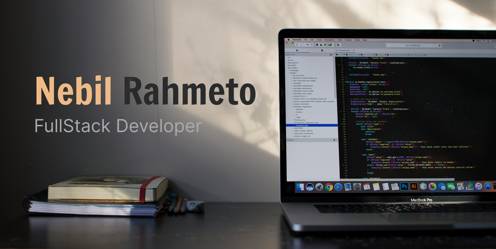

### Hi👋, I'm Nebil
I am a Full-Stack developer from Ethiopia passionate about building scalable and efficient web apps that provide an enjoyable user experience. I specialize in React/Next.js for frontend and Node.js for backend. I also have experience in cross-platform mobile development using Flutter and React native.
- 🌱 I’m currently learning testing frameworks to build robust apps.
- 👯 I’m looking to collaborate on any fun projects
#### Connect with me:
<p align="left">  
<a href="https://linkedin.com/in/nebilrahmeto" target="_blank"></a>  
<a href="https://www.leetcode.com/patrix726" target="_blank"></a>  
</p>

---

### 🧰 Languages

<p align="left">


</p>

<br/>
<br/>

###  Libraries/Frameworks

<p align="left">


</p>

<br/>
<br/>

###  Database

<p align="left">


</p>


<br/>
<br/>

### 🔧 Tools

<p align="left">


</p>

### 📊 Stats

<div align="center" style="width: 100%; display: flex; flex-direction: row; align-items: center; justify-content: space-around; gap: 40px;">
  
  
</div>
<!--START_SECTION:waka-->

```txt
From: 15 January 2026 - To: 14 February 2026

Total Time: 69 hrs 46 mins

TypeScript     50 hrs 44 mins  ██████████████████▒░░░░░░   72.73 %
HTTP           4 hrs 28 mins   █▓░░░░░░░░░░░░░░░░░░░░░░░   06.41 %
Markdown       2 hrs 58 mins   █░░░░░░░░░░░░░░░░░░░░░░░░   04.27 %
JSON           2 hrs 18 mins   ▓░░░░░░░░░░░░░░░░░░░░░░░░   03.30 %
Bash           1 hr 55 mins    ▓░░░░░░░░░░░░░░░░░░░░░░░░   02.75 %
```

<!--END_SECTION:waka-->
<br/>


